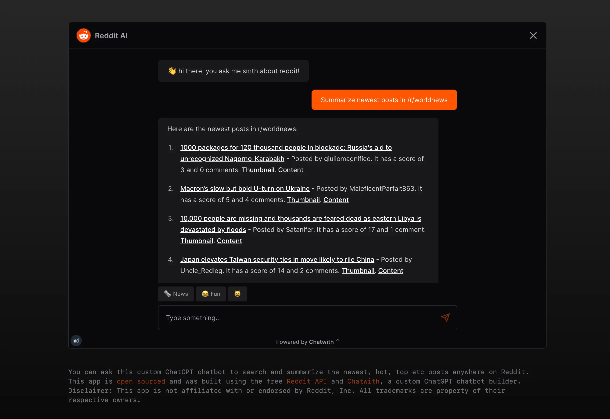

This is a NextJS project with custom chatbot. Features:

- a slim wrapper over the [Reddit API](https://www.reddit.com/dev/api/) to expose only useful endpoints and trim data payloads
- An OpenAPI spec file in YAML for the [Chatwith](https://chatwith.tools) chatbot
- a landing page with a chatbot iframe embed

<center>
  
</center>

## Getting Started

First, run the development server:

```bash
bun dev
# or
npm run dev
# or
pnpm dev
```

Open [http://localhost:3000](http://localhost:3000) with your browser to see the result.

## Contributing

PRs are welcome! The API can be extended to allow chatbot interactions like:

- Looking up older posts, eg from a year ago
- Fetching user information and profiles
- Searching by categories, post types etc
